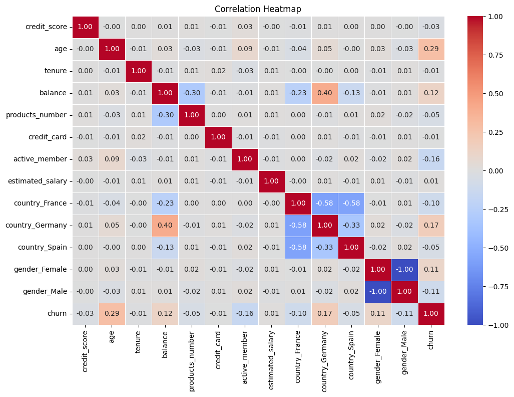
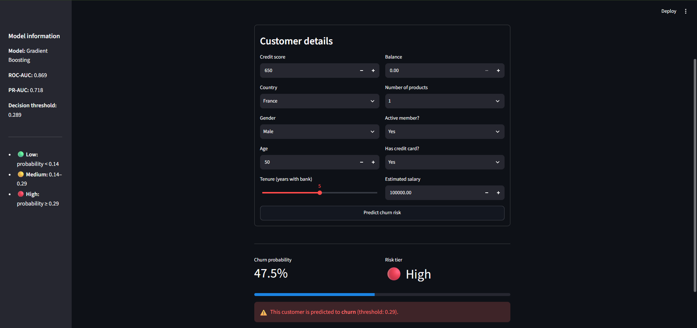

# 🏦 Customer Churn Prediction

A Machine Learning project that predicts whether a bank customer is likely to churn based on demographic and banking information. The project follows an end-to-end machine learning workflow, from data exploration to deployment with an interactive Streamlit application.

---

## 📌 Project Overview

An end-to-end machine learning solution for predicting customer churn using banking customer data.

### Project Pipeline

- Data Validation
- Exploratory Data Analysis (EDA)
- Data Preprocessing & Feature Engineering
- Model Comparison
- Threshold Optimization
- Model Evaluation
- Streamlit Deployment
- Batch Prediction CLI

---

## ✨ Highlights

- End-to-end Machine Learning pipeline
- Comprehensive EDA and feature engineering
- Compared multiple classification algorithms
- Optimized decision threshold for business use case
- Streamlit web application
- Batch prediction support via CLI
- Saved model artifacts for reproducible inference

---

## 📊 Dataset

The dataset contains customer information from **ABC Multistate Bank**, where each record represents one customer.

### Features

| Feature          | Description                |
| ---------------- | -------------------------- |
| Customer ID      | Unique customer identifier |
| Credit Score     | Customer credit score      |
| Country          | Customer country           |
| Gender           | Male / Female              |
| Age              | Customer age               |
| Tenure           | Years with the bank        |
| Balance          | Account balance            |
| Products         | Number of bank products    |
| Credit Card      | Credit card ownership      |
| Active Member    | Active account status      |
| Estimated Salary | Annual estimated salary    |

### Target Variable

| Value | Meaning          |
| ----: | ---------------- |
|     0 | Customer Stayed  |
|     1 | Customer Churned |

---

## 🔍 Exploratory Data Analysis

The EDA focuses on understanding customer behavior and identifying factors influencing churn.

### Data Quality Checks

- Missing value analysis
- Duplicate record detection
- Data type verification
- Descriptive statistics
- Unique value analysis

### Customer Analysis

- Churn distribution
- Country-wise churn rate
- Gender-wise churn rate
- Age distribution
- Credit score distribution
- Balance distribution
- Salary distribution
- Product-wise churn
- Active member analysis
- Correlation heatmap

### Key Insights

- Older customers are more likely to churn.
- Customers with multiple products exhibit non-linear churn behavior.
- Active members churn significantly less than inactive customers.
- Country and customer activity influence churn probability.
- Tree-based models capture these complex relationships effectively.

---

## 🔧 Feature Engineering

Additional features created:

- **`high_products`** — identifies customers owning three or more banking products.
- **`country_active`** — interaction feature combining country and active-member status.

The preprocessing pipeline also performs:

- Removal of non-predictive identifier columns
- One-Hot Encoding of categorical variables
- Feature alignment during inference
- Model artifact persistence using Joblib and JSON

---

## 🤖 Models Evaluated

The following classification models were compared:

- Logistic Regression
- Random Forest Classifier
- Gradient Boosting Classifier
- AdaBoost Classifier
- Extra Trees Classifier
- CatBoost Classifier

After evaluation, the **Gradient Boosting Classifier** delivered the best overall performance and was selected for deployment.

---

## 🏆 Final Model Performance

| Metric             |     Score |
| ------------------ | --------: |
| ROC-AUC            | **0.869** |
| PR-AUC             | **0.718** |
| Decision Threshold | **0.289** |

Instead of the default **0.50** cutoff, predictions use the optimized decision threshold obtained during model evaluation to improve churn detection.

---

## 📈 Prediction Output

For every customer, the prediction pipeline returns:

- **Churn Probability**
- **Predicted Class**
- **Risk Tier**
  - 🟢 Low
  - 🟡 Medium
  - 🔴 High

---

## 🚀 Streamlit Application

The application allows users to:

- Enter customer banking information
- Predict customer churn instantly
- View churn probability
- Display customer risk tier
- View model evaluation metrics

### Run Locally

```bash
python -m venv .venv

# Windows
.venv\Scripts\activate

# Linux/macOS
source .venv/bin/activate

pip install -e ".[dev]"

streamlit run app/app.py
```

---

## 💻 Batch Prediction

Generate predictions for multiple customers using a CSV file.

```bash
churn-predict --input path/to/customers.csv --output predictions.csv
```

---

## 📁 Project Structure

```text
Customer_Churn_Prediction/
│
├── README.md
├── pyproject.toml
├── setup.py
│
├── app/
│   └── app.py
│
├── data/
│   └── raw/
│       ├── Bank Customer Churn Prediction.csv
│       └── about_dataset.txt
│
├── models/
│   ├── model.pkl
│   ├── model_columns.pkl
│   └── model_metadata.json
│
├── notebooks/
│   ├── EDA.ipynb
│   └── Model_Evaluation.ipynb
│
└── src/
    └── churn_predictor/
        ├── artifacts.py
        ├── config.py
        ├── inference.py
        └── preprocessing.py
```

---

## 🛠️ Technologies Used

### Programming

- Python

### Data Analysis

- Pandas
- NumPy
- Jupyter Notebook

### Visualization

- Matplotlib
- Seaborn

### Machine Learning

- Scikit-learn
- CatBoost

### Deployment

- Streamlit

### Utilities

- Joblib

---

## 📷 Project Screenshots

### Correlation Heatmap



### Streamlit Application



---

## 🔮 Future Improvements

- Hyperparameter optimization
- Automated data validation
- Streamlit Community Cloud deployment
- Database integration for prediction history
- MLflow experiment tracking

---

## 📚 Key Learnings

- Feature engineering significantly improved predictive performance.
- Tree-based ensemble methods outperformed linear models.
- Decision threshold optimization produced more practical churn predictions than the default 0.50 cutoff.
- Maintaining identical preprocessing during training and inference is essential for reliable predictions.
- Persisting model artifacts ensures reproducible and consistent deployment.

---

## 👨‍💻 Author

**Shubham Mane**

Machine Learning • Data Science • Python

- GitHub: https://github.com/ShubhamMane1211
- LinkedIn: https://linkedin.com/in/shubhammane1211
- Email: [shubhammane586@gmail.com](mailto:shubhammane586@gmail.com)

---

If you found this project useful, consider giving it a ⭐ on GitHub.
